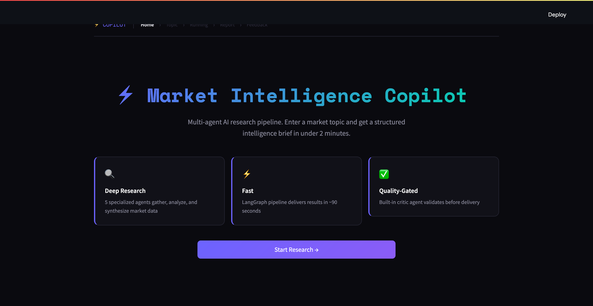
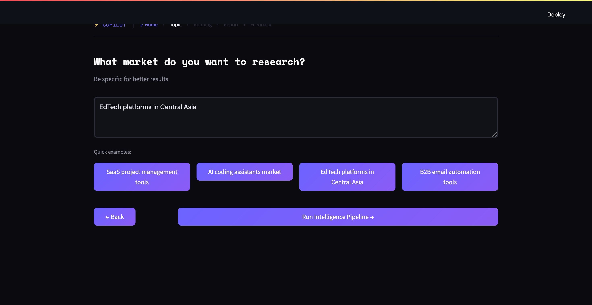
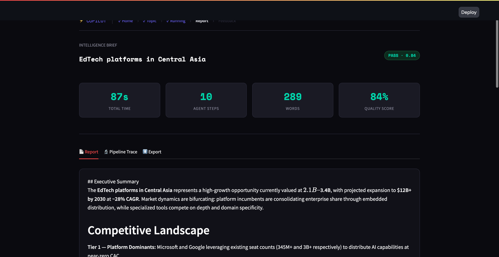
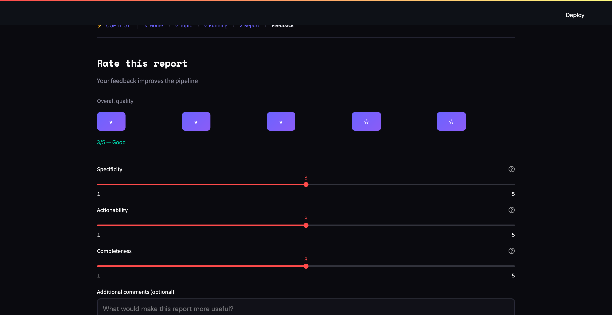

# Week 09 — AI Market Intelligence Copilot MVP

**Тема:** Low-Code MVP  
**Стек:** Python · Streamlit · LangGraph (Week 8) · Anthropic API  
**Статус:** ✅ Live MVP

---

## Что это

Streamlit-приложение которое превращает multi-agent research pipeline (Weeks 7-8) в живой продукт с UI. Пользователь вводит тему рынка и получает структурированный intelligence brief за ~90 секунд.

```
Landing → Onboarding → Pipeline → Report → Feedback
```

---

## Скриншоты

| Landing | Onboarding |
|---|---|
|  |  |

| Report | Feedback |
|---|---|
|  |  |

---

## Запуск

```bash
# 1. Зависимости
pip install streamlit

# 2. API ключ
export ANTHROPIC_API_KEY="sk-ant-..."

# 3. Запуск
streamlit run app.py
# → http://localhost:8501
```

**Важно:** если `../week-08/langgraph_pipeline.py` доступен — приложение запускает реальный LangGraph pipeline. Иначе — demo fallback с sample report.

---

## Структура файлов

```
week-09/
  app.py              ← основное приложение (666 строк)
  screenshots/        ← скриншоты всех экранов
  README-week9.md     ← этот файл
```

---

## Flow — 5 экранов

### 1. Landing
Hero с gradient заголовком, 3 feature cards (Deep Research / Fast / Quality-Gated), CTA кнопка.

### 2. Onboarding
Textarea для ввода темы + 4 quick-pick кнопки для мгновенного старта без печати.

### 3. Pipeline
Анимированные шаги агентов с progress bar. Каждый агент показывает статус в реальном времени.

```
🗂️ Planner    — Decomposing research topic
🔍 Researcher  — Gathering market intelligence  
📊 Analyst    — Synthesizing findings
⚖️  Critic     — Validating quality gate
✍️  Writer     — Generating intelligence brief
```

### 4. Report
Метрики (время / шаги / слова / quality score) + 3 вкладки:
- **Report** — markdown brief с рендерингом
- **Pipeline Trace** — лог каждого шага с timestamps
- **Export** — скачать `.md` или `.json`

### 5. Feedback
Star rating (1-5) + 3 dimension слайдера (Specificity / Actionability / Completeness) + text area.

---

## Пример вывода

**Топик:** EdTech platforms in Central Asia  
**Время:** 87s | **Steps:** 10 | **Quality:** PASS · 0.84

```
## Executive Summary
The EdTech platforms in Central Asia represents a high-growth opportunity
currently valued at $2.1B–$3.4B, with projected expansion to $12B+ by 2030...

## Competitive Landscape
Tier 1 — Platform Dominants: Microsoft and Google leveraging existing 
seat counts (345M+ and 3B+ respectively)...

## Pricing Models
| Segment        | Range              |
|----------------|--------------------|
| Consumer       | $0–$20/mo          |
| SMB            | $20–$50/mo         |
| Enterprise     | $30–$100/user/mo   |
| Vertical       | $500K–$5M ACV      |
```

---

## Дизайн

- **Тема:** тёмная (`#0a0a0f` background)
- **Типографика:** Space Mono (заголовки, монospace данные) + DM Sans (body)
- **Акцент:** `#6c63ff` (фиолетовый) + `#00d4aa` (teal)
- **Анимации:** pulsing border на активном шаге агента

---

## Связь с предыдущими неделями

| Компонент | Откуда |
|---|---|
| Multi-agent pipeline | Week 7 (`pipeline.py`) |
| LangGraph StateGraph | Week 8 (`langgraph_pipeline.py`) |
| Tool calling | Week 6 (`tools/`) |
| LLM judges (качество) | Week 5 (`judge_*.py`) |
| Memory pipeline | Week 3 (`memory_pipeline.py`) |

---

## Известные ограничения

- Streamlit слайдеры не перекрашиваются под тёмную тему (CSS limitation)
- Pipeline прогресс не real-time streaming — агенты запускаются блоком
- Нет истории запросов между сессиями (in-memory only)

---


*Week 9 of 12 · AI Product Engineer Journey 
